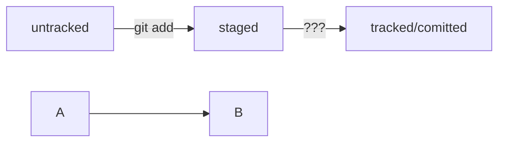
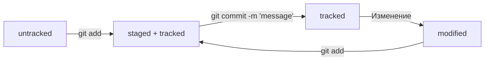

# Как пользоваться гитом

*(свободная трактовка, для тех, кому не очень интересно)*

* Создаем папку, например `mkdir papka` в терминале или как угодно еще, гитинитим.
* Теперь погнали на гитхаб и добавили туда ключи. Где взять ключи? Сгенерить `ssh-keygen что-то там`, на гитхабе есть подробная инструкция если что.
* Создаем репозиторий на гитхабе и там сразу написано что делать дальше. Ветку в `main` не переименовываем.
* Соединяем удаленный репо с локальным как сказал гитхаб, гит ремоут и все такое и пушим.
* В первом пуше пишем `-u`, непонятно зачем и `origin master`.
* Создаем в папке файл, пишем `git status`, получаем неотслеживаемые файлы, `git add --all` (все) - добавляем их для коммита.
* `git commit -m 'текст коммита'` - сохранили тип, пушим.

## Примерно такая вот последовательность

```
mkdir papka
git init
touch file.md
git remote add origin <url>
git remote -v
git status
git add --all
git status
git commit -m "message"
git push -u origin master
```

все



# Жизненный цикл файлов

```mermaid
graph LR;
  untracked --> B["git add tracked + staged"];
  git add --> git commit -m "message" tracked;
  git commit -m 'message' tracked --> Изменение файла;
  Изменение файла --> modified;
  modified --> git add;
```


