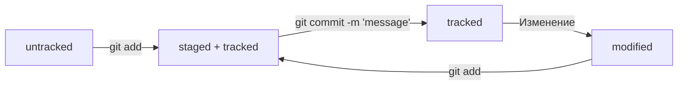

# Как пользоваться гитом

*(свободная трактовка, для тех, кому не очень интересно)*

* Создаем папку, например `mkdir papka` в терминале или как угодно еще, гитинитим.
* Теперь погнали на гитхаб и добавили туда ключи. Где взять ключи? Сгенерить `ssh-keygen что-то там`, на гитхабе есть подробная инструкция если что.
* Создаем репозиторий на гитхабе и там сразу написано что делать дальше. Ветку в `main` не переименовываем.
* Соединяем удаленный репо с локальным как сказал гитхаб, гит ремоут и все такое и пушим.
* В первом пуше пишем `-u`, непонятно зачем и `origin master`.
* Создаем в папке файл, пишем `git status`, получаем неотслеживаемые файлы, `git add --all` (все) - добавляем их для коммита.
* `git commit -m 'текст коммита'` - сохранили тип, пушим.

## Примерно такая вот последовательность

```
mkdir papka
git init
touch file.md
git remote add origin <url>
git remote -v
git status
git add --all
git status
git commit -m "message"
git push -u origin master
```

все

не все

## Хэш коммита

Хэш коммита это главный идентификатор коммита. Он шифруется при помощи алгоритма `SHA-1` (вроде). В хэш коммита входит информация о дате создания коммита, авторе, сообщение коммита, текущие файлы в репозитории, хэш 
tree и хэш родительского коммита. Вобщем в коммите вся инфа про все все все ДО. Но это все сложно, не совсем поняла(

Посмотреть историю коммитов можно при помощи команды `git log`. В выводе мы увидим:

* хэш коммита
* автора коммита
* дату создания коммита
* сообщение коммита

Коммиты идут по порядку от самого последнего к более раннего. *Первый коммит в git был создан Линусом Торвальдсом в апреле 2005 года*. Хэш коммита можно использовать например для некоторых команд гита для обозначения 
определенного комита.

Существует так же краткая версия команды - `git log --oneline`. Каждый коммит отображается в одну строчку. Там мы увидим хэш коммита и сообщение, хэш отображается не во всю длинну, а ровно столько символов сколько 
нужно чтобы обеспечить уникальность, обычно это 7 символов.

## HEAD

В истории коммитов мы можем увидеть обозначение `HEAD`. HEAD это один из служебных файлов скрытой папки `.git`, он указывает на последний коммит в проекте, 
если перейти в этот файл - мы увидим хэш последнего коммита.

## Жизненный цикл файлов



## Изменение последнего коммита

```
git commit --amend
git commit --amend --no-edit
git commit --amend -m 'message'
```

## Откат изменений

```
git restore --staged <file>
git restore <file>
git reset --hard <commit hash>
```

## Посмотреть изменения

```
git diff
git diff --staged
git diff <коммит1> <коммит2>
```
